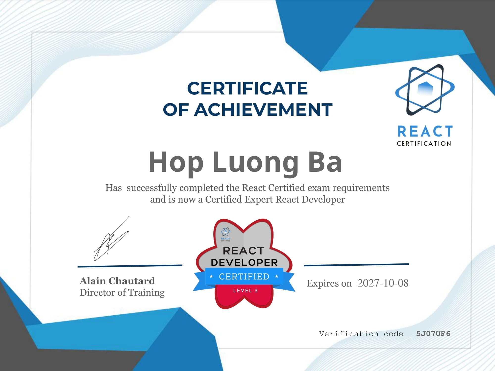
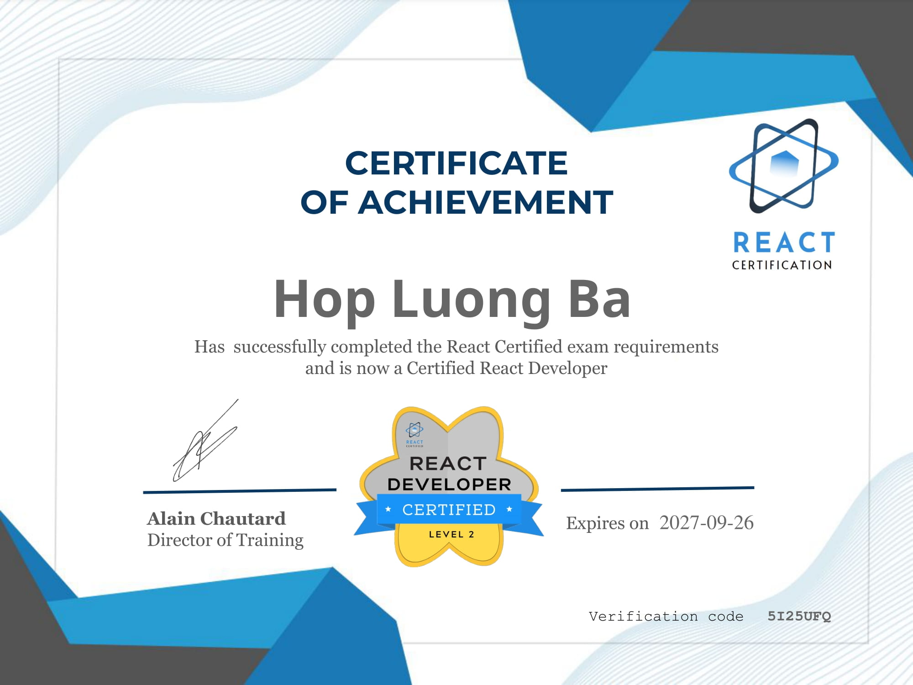

# Hi there, I'm Steve Luong Ba Hop 👋

I'm a passionate Full-Stack JavaScript Developer with a strong background in building scalable web applications. I have experience working with a variety of technologies and frameworks, and I love to learn and explore new tools and techniques.

## 🚀 About Me

- 🔭 I’m currently working at [FPT-SOFTWARE](https://fptsoftware.com/)
- 🌱 I’m currently learning [Python](https://www.python.org/)
- 👯 I’m looking to collaborate on a startup
- 💬 Ask me about JavaScript, Node.js, React, or anything tech-related
- 📫 How to reach me: luonghop.lc@gmail.com
- ⚡ Fun fact: I am a technology geek, full-time web developer, and part-time tinkerer.

## 🛠️ Skills

### Frontend

- **Languages**: JavaScript, TypeScript, HTML, CSS
- **Frameworks/Libraries**: React, Redux, Next.js, Angular
- **Tools**: Webpack, Babel, ESLint, Prettier

### Backend

- **Languages**: JavaScript, TypeScript, PHP
- **Frameworks**: Node.js, Express, NestJS
- **Databases**: MongoDB, PostgreSQL, MySQL
- **Tools**: Docker, Kubernetes, Nginx

### DevOps

- **CI/CD**: GitHub Actions, Jenkins
- **Cloud**: AWS, Google Cloud, Azure
- **Containerization**: Docker, Kubernetes

## 🏆 Achievements

#### ⚡ [Expert ReactJs Developer Certification](react-certification.com)

The certification is all about components, state, props, and Javascript, as well as a bit of routing, forms, and hooks.

  
  

## 📚 Projects

### [React Exam: Quiz maker based on a trivia API](https://github.com/luongbahop/quizzes/)

GOAL: Build a small quiz maker application that creates a 5-question quiz based on a trivia API
Demo: [quizzes.web5days.com](https://quizzes.web5days.com/)

### [React Exam: Build common components](https://github.com/luongbahop/advanced-reactjs-exercises)

GOAL: Create 3 different generic APIs and components
Demo: [exercises.web5days.com](https://exercises.web5days.com/)

## 📈 GitHub Stats

## 📫 Connect with Me

- LinkedIn: [Lương Bá Hợp](https://www.linkedin.com/in/steve-luong-ba-hop-88890ba0/)
- Facebook: [Lương Bá Hợp](https://www.facebook.com/steve.luong.5)
- Personal Website: [hoplb.com](https://hoplb.com)

## ⭐️ From [Luong Ba Hop](https://github.com/luongbahop)
